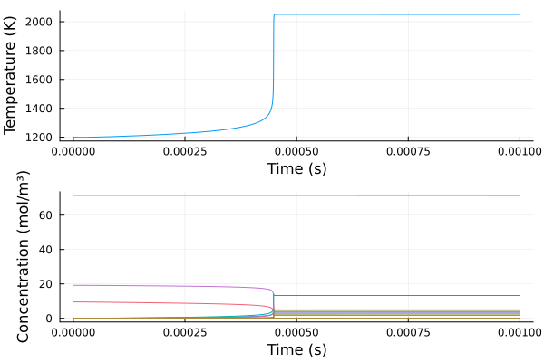
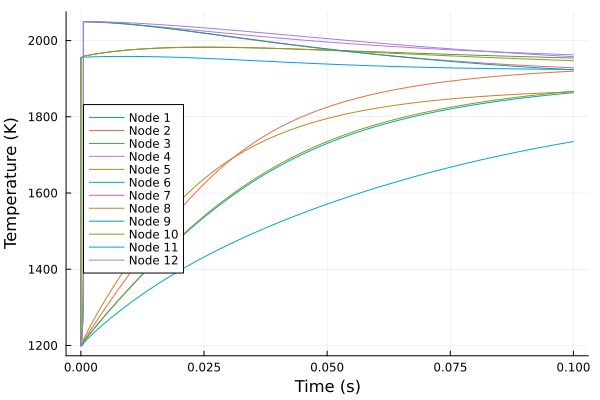
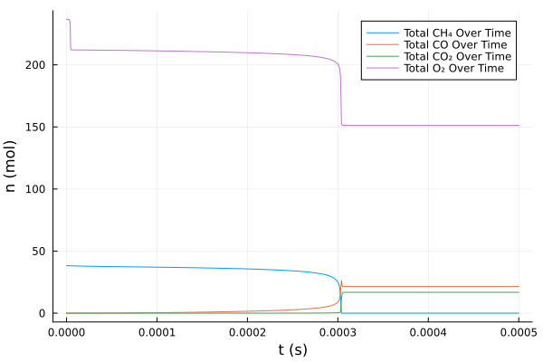

# 🔬 Chemical Combustion Simulation

Welcome to the repository for my bachelor thesis project! This project focuses on mathematically modeling and simulating chemical combustion reactions using skeletal reaction models and complex reactor networks. 

📖 **Read the full thesis here:** [TU Delft Education Repository](https://resolver.tudelft.nl/uuid:75ad9258-265d-410a-a35e-b4129e8437c6)

## 🚀 Overview

All code for this project is written natively in **Julia**. 
The simulation handles skeletal reaction models by loading `.yaml` files containing chemical data for very large reaction mechanisms, often involving tens of species and hundreds of distinct reactions. 

### Technical Highlights & Architecture:
- **Optimization:** Initial implementations of reactor networks proved that a lot of code was suboptimal and incompatible with efficient methods. The architecture has since been heavily revised.
- **Automatic Differentiation (AD):** All parameters and variables are now cached, and all functions accept variables of types abstract enough to fully support automatic differentiation.
- **Performance constraints:** While there are probably still too many allocations happening in `Chemistry.jl`, the models run successfully. With the right tolerances and algorithms, complex network simulations are completely viable (even if the performance seems bad, but so is my laptop!).

---

## 📊 Visualizations & Results

Below are some of the visualizations generated by the different simulation models, analyzing species concentrations and temperature across networks.

### Single Node Methane (CH4) Simulation

### Laurent Network Analysis
*Analysis of the Laurent mechanism running through the reactor network.*

**Network Temperature (T3):**

**Network Totals:**

---

## 📂 Key Files
* **`Chemistry.jl`**: The core chemical kinetics, thermodynamics, and mathematical engine.
* **`Single-node skeletal model.ipynb`**: Implementation of the standalone skeletal model.
* **`12-node skeletal model.ipynb`**: Implementation of the expanded 12-node reactor network.
* **`*.yaml` files**: Chemical mechanisms data (GRI-Mech 3.0, Laurent, Lu, etc.).
